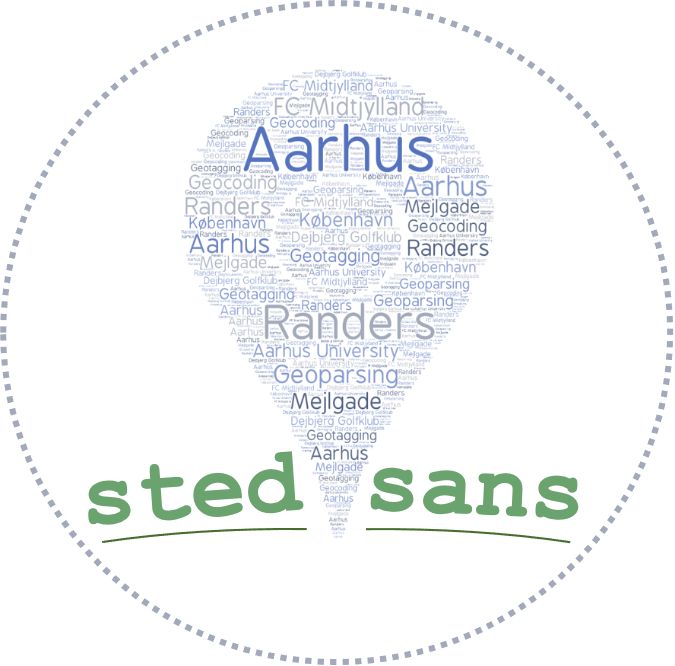

<!-- PROJECT LOGO -->
<br />
<p align="center">
  <a href="hhttps://github.com/MalteHB/stedsans">
    
  </a>

  <h3 align="center">stedsans: A Geoparsing Toolkit for Pythonk</h3>

  <p align="center">
    Exam Project for Spatial Analysis - Cultural Data Science Elective 2021
    <br />
<br>

# ```stedsans```
`stedsans` is an innovative  Danish and English geoparsing toolkit for Python that facilitates efficient retrieval of the geospatial information embedded in textual data. The package is designed to handle textual input ranging from a single sentence to a large corpus. To broaden the appeal of the package and further set it apart from existing software, we decided to integrate user-friendly functions for visualising and statistically analysing the extracted geospatial data. `stedsans`  neatly compresses highly complex workflows into a single package with predefined functionalities that are tailored to the most common research questions and is aimed at the novice to intermediate geospatial analyst who has basic familiarity with coding and quantitative analyses. `stedsans`  utilizes Transformer-based models (Vaswani et al, 2017), including the Danish [Ælæctra](https://huggingface.co/Maltehb/-l-ctra-danish-electra-small-cased-ner-dane) and the English [BERT](https://huggingface.co/dslim/bert-base-NER) fine-tuned for Named Entity Recognition, to geotag entities. The GIS software Nominatim (v3.7.2) is used as the geocoding engine. Nominatim obtains data from the OpenStreetMap database (OpenStreetMap contributors, 2017). See metadata tables for licenses and documentation. 


## Demonstration of `stedsans`
For a demonstration of the current tools, we strongly suggest that use the following Google Colab notebook. This provides a guided demonstration of the key functionalities of the package: 

[](https://colab.research.google.com/github/MalteHB/stedsans/blob/main/notebooks/stedsans_demo.ipynb)
## Installation
`stedsans` is developed and tested on Python 3.7+.
### Windows
Since `stedsans` requires the package `geopandas`, and the dependencies can cause several issues when using Windows, it is recommended to first install [Anaconda](https://docs.anaconda.com/anaconda/install/), which comes with pre-built binaries for `geopandas`. 

After having installed Anaconda, create a conda environment and then install `stedsans` using `pip` and `geopandas` using `conda`.

```bash 
pip install stedsans
```

```bash 
conda install geopandas==0.9.0
```

### MacOS and Linux
For MacOS and Linus `stedsans` and `geopandas` can be installed directly by using `pip`.

```bash 
pip install stedsans
```
```bash 
pip install geopandas==0.9.0
```

## Usage
To use `stedsans` start by importing `stedsans`.
```python
from stedsans import stedsans
```
We can then initialize a `stedsans` instance on a pre-defined example text, and print the extracted entities.
```python
>>> example_text = "Hello my name is Malte and i live in Aarhus C. I love watching Randers FC, a football team from Randers, beat Brøndby IF, a football team from the devils island of Sjælland."

>>> my_stedsans = stedsans(example_text, language="english")

>>> my_stedsans.print_entities()

[   ('Aarhus C', 'LOC'),
    ('Randers FC', 'ORG'),
    ('Randers', 'LOC'),
    ('Brøndby IF', 'ORG'),
    ('Sjælland', 'LOC')]
```

These locations can then be vizualised using the `plot_coordinates()` function, and we can specify it to limit the locations to only coming from Denmark. This results in an interactive map.
```python
>>> my_stedsans.plot_locations(limit="country", limit_area="Denmark")
```
<div align="center">
  
</div>


<br />

You can also plot an interactive heatmap with `plot_heatmap()`.
```python
>>> my_stedsans.plot_heatmap(limit="country", limit_area="Denmark")
```
<div align="center">
  
</div>

<br />

`stedsans` provides lots of other features and tools and these are very thoroughly demonstrated in the Google Colab (if it wasn't obvious already - we really want you to use the colab:grinning:):

[](https://colab.research.google.com/github/MalteHB/stedsans/blob/main/notebooks/stedsans_demo.ipynb)

## References

OpenStreetMap contributors. (2017). Planet dump retrieved from https://planet.osm.org  [Retrieved on	 09-07-2021]
<br>
<br>
Vaswani, A., Shazeer, N., Parmar, N., Uszkoreit, J., Jones, L., Gomez, A. N., Kaiser, Ł., & Polosukhin, I. (2017). Attention is All you Need. In I. Guyon, U. V. Luxburg, S. Bengio, H. Wallach, R. Fergus, S. Vishwanathan, & R. Garnett (Eds.), Advances in Neural Information Processing Systems 30 (pp. 5998–6008). Curran Associates, Inc. http://papers.nips.cc/paper/7181-attention-is-all-you-need.pdf


## Metadata

### Metadata for software

| Software metadata description                                                  |                                                                                                                                                                                                                                                                                   |
| ------------------------------------------------------------------------------ | ---------------------------------------------------------------------------------------------------------------------------------------------------------------------------------------------------------------------------------------------------------------------------------- |
| General software dependencies                                                  | Python v3.8<br>stedsans v0.0.13-alpha<br>Anaconda Software Distribution<br>Transformers v4.4.2<br>PyTorch v1.7.1<br>NLTK v3.5<br>NumPy v1.20.1<br>Nominatim v3.7.2<br>GeoPy v2.1.0<br>GeoPandas v0.9.0<br>pointpats v2.2.0<br>Folium v0.12.1<br>matplotlib v3.1.3 |
| Permanent link to your code in your Github repository                          | [Link to GitHub: https://github.com/MalteHB/stedsans ](https://github.com/MalteHB/stedsans)                                                                                                                                                                                        |
| Legal Software License                                                         | [This project is licensed under the  Apache License, Version 2.0, January 2004. See: http://www.apache.org/licenses/](http://www.apache.org/licenses/)<br><br>The source code for the Nominatim software is available under a GPLv2 license. |
| Computing platform / Operating System                                          | Microsoft Windows 10, macOS, Ubuntu 18.04, Google Colaboratory                                                                                                                                                                                                                           |
| Installation requirements & dependencies for software not used in class        |  See section on Software Framework, README in the GitHub Repository or the demonstration notebook file                                                                                                                                                                             |
| If available Link to software documentation for special software               | Link to geocoding engine: https://github.com/osm-search/Nominatim - Documentation available at: https://nominatim.org/release-docs/latest/                                                                                                                                         |                                        |
---

### Metadata for data

| Metadata description          |                                                                                                                                                                                                                                                                                                                                                                                      |
| ----------------------------- | ------------------------------------------------------------------------------------------------------------------------------------------------------------------------------------------------------------------------------------------------------------------------------------------------------------------------------------------------------------------------------------ |
| Data Licenses                 | OpenStreetMap<sup>®</sup> is open data, licensed under the Open Data Commons Open Database License (ODbL) by the OpenStreetMap Foundation(OSMF). Documentation available on: https://wiki.openstreetmap.org/wiki/Main\_Page                                                                                                                                                          |
| Dataset: KOMMUNE.shp          | Shapefile map layer of Denmark inherent to the package. Obtained from ‘Kortforsyningen’ under ‘Styrelsen for Dataforsyning og Effektivisering’.  The data is open and public and can be downloaded from: https://download.kortforsyningen.dk/content/danmarks-administrative-geografiske-inddeling-110000   <br><br>Relevant columns include: <br>- DAGI\_ID: Identifier for the municipalities.<br>\- KOMNAVN: Name of the municipalities<br>\- REGIONKODE: Identifier for the regions.<br>\- REGIONNAVN: Name of the regians |
| Dataset: jylland\_article.txt | [Example article used for demonstrating the package functionalities. This file is inherent to the library. The article was obtained from the encyclopedia Den Store Danske.: https://denstoredanske.lex.dk/Jylland\_-\_landsdel ](https://denstoredanske.lex.dk/Jylland_-_landsdel)                                                                                                  |
## Contact

For help or further information feel free to connect with either of the main developers:

**Malte Højmark-Bertelsen**
<br />
[hjb@kmd.dk](mailto:hjb@kmd.dk?subject=[GitHub]%20stedsans)


[][twitter]
[][linkedin]

<br />

</details>

[twitter]: https://twitter.com/malteH_B
[linkedin]: https://www.linkedin.com/in/maltehb

<br />

**Jakob Grøhn Damgaard** 
<br />
[bokajgd@gmail.com](mailto:bokajgd@gmail.com?subject=[GitHub]%20stedsans)


[][twitter]
[][linkedin]

<br />

</details>

[twitter]: https://twitter.com/JakobGroehn
[linkedin]: https://www.linkedin.com/in/jakob-gr%C3%B8hn-damgaard-04ba51144/
